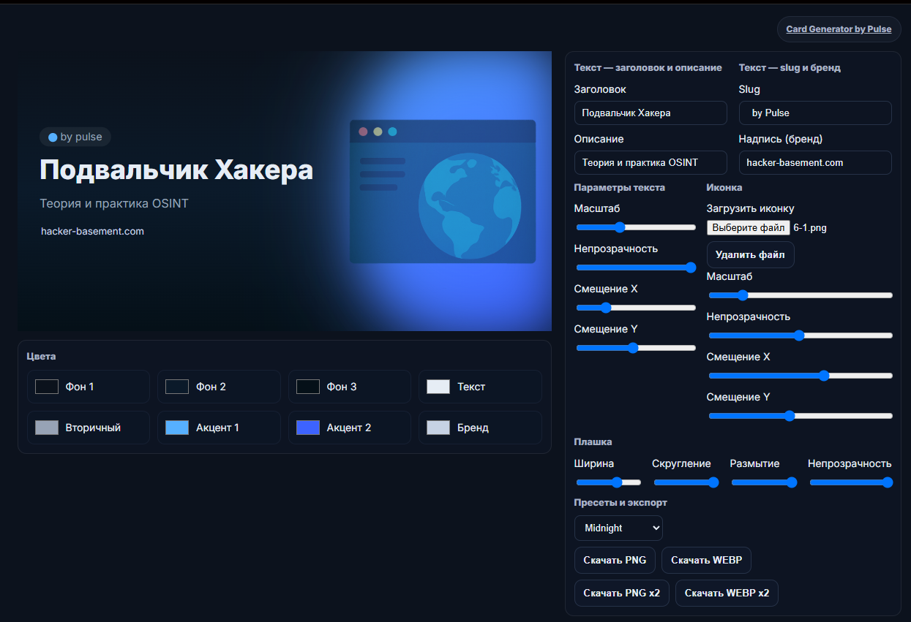
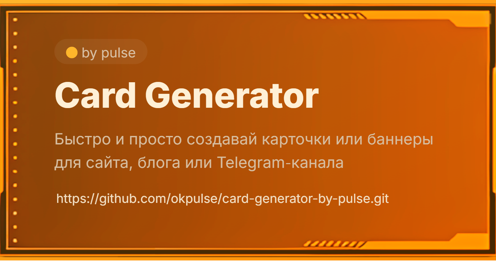

# Card Generator by Pulse

[Русский](README.md) | [English](README.en.md) | [Українська](README.ua.md)

---

**Card Generator by Pulse** is a tool that lets you quickly and easily create cards or banners for a website, blog, or a Telegram channel (or anywhere else).

▶️**Use online:** https://okpulse.github.io/card-generator-by-pulse/  



---

## 💎 Features

- 🎨 Generate cards in PNG and WEBP  
  - default resolution: **1280×640 px**  
  - high quality: **2560×1280 px (×2)**
- 🌈 Color controls: background, accents, text, brand
- 📐 Plate size, corner radius, and blur controls
- 🧩 Upload your own icons
- 🌓 Custom background support
- 💫 Built‑in color presets — 10 options

---

## 🧰 Who it’s for

For anyone who needs to create cards with content descriptions quickly and without overthinking the process.

---

## ⚙️ How to use

1. **Download the project**: click `Code → Download ZIP`, or clone it:
```bash
git clone https://github.com/okpulse/card-generator-by-pulse.git
cd card-generator-by-pulse
```
2. **Open the project** in your browser (the `index.html` file).  
3. **Enter your data:**
   - Category title  
   - Short description  
   - Slug (category tag)  
   - Brand text (site name or whatever you use)  
   To leave a field empty — enter a space instead of text.
4. **Upload an icon** (PNG or SVG).  
5. Adjust colors, blur, and text parameters.  
6. Click **“Download PNG”** or **“Download WEBP”**  
  - default resolution: **1280×640 px**  
  - **X2** downloads at **2560×1280 px**


---

### ➕ Custom background

You don’t have to use the uploaded image strictly as an icon — you can also turn it into a background. To do this:
  - upload the image;
  - set its scale and position (stretch and center it);
  - hide the plate in the plate settings by moving the slider to the right (or stretch it across the screen if you want a brighter image);
  - choose presets or fine‑tune the palette manually.

An example of what you can get:


---

### 🎨 Palette
  - `BG 1` — the top part of the background (the background is set with a three‑stop gradient)
  - `BG 2` — the central part of the background
  - `BG 3` — the bottom part of the background
  - `Text` — the title color
  - `Secondary` — the description color
  - `Accent 1` — the first color of the plate gradient (top‑left)
  - `Accent 2` — the second color of the plate gradient (bottom‑right)
  - `Brand` — the brand/footnote color

---

## 🌐 About the author

If you’re into OSINT, check out my resources:

[](https://hacker-basement.com/) [](https://www.youtube.com/@pulse_os) [](https://t.me/Pulsechanel)

---

## ❤️ Support the project

If the project was helpful and you’d like me to add more features, you can support development:

- [💎 Patreon](https://www.patreon.com/pulsepagemy)  
- [💰 Monobank](https://send.monobank.ua/jar/U32Yc8ML3) 
- [⭐ Become a channel member on YouTube](https://www.youtube.com/channel/UCojEUrPvEvkUXEU3QWwhCwg/join)
- 💲 **USDT (TRC20):** `TMDLY3qRZN81b5xn9Z9Wg2y3Y6aeBpV5Z6` 
