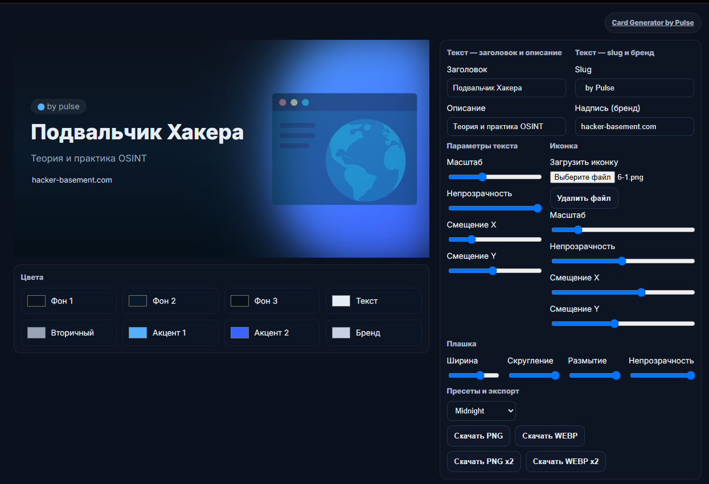
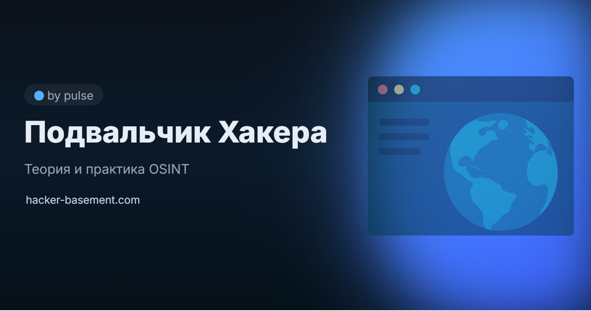
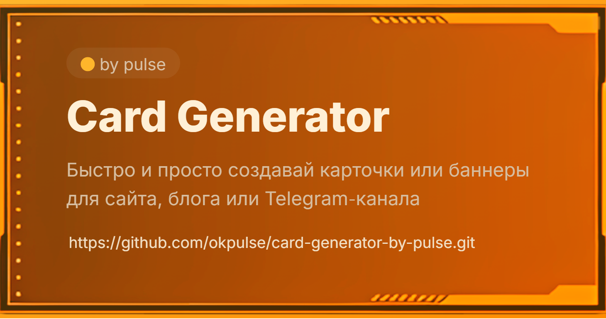

# Card Generator by Pulse

**Card Generator by Pulse** — это инструмент, позволяющий быстро и просто создавать карточки или баннеры для сайта, блога или Telegram‑канала (ну или куда-то ещё).  



---

## 💎 Возможности

- 🎨 Генерация карточек в PNG и WEBP  
  - стандартное разрешение: **1280×640 px**  
  - повышенное качество: **2560×1280 px (×2)**  
- 🌈 Настройка цветов: фон, акценты, текст, бренд  
- 📐 Управление размерами, скруглением и размытием плашки  
- 🧩 Загрузка пользовательских иконок  
- 🌓 Поддержка кастомного фона  
- 💫 Встроенные пресеты цветового оформления - 10 штук

---

## 🧰 Кому будет полезен

Всем кому нужно создавать карточки с описанием контента и при этом хочется дедать это быстро и особо не заморачиваясь.   

---

## ⚙️ Как пользоваться

1. **Скачайте проект** нажав `Code → Download ZIP` или клонируйте:
```bash
git clone https://github.com/okpulse/card-generator-by-pulse.git
cd card-generator-by-pulse
```
2. **Открой проект** в браузере (файл index.html).  
3. **Введите данные:**
   - Заголовок категории  
   - Короткое описание  
   - Slug (метка категории)  
   - Надпись (бренд или сайт) 
   чтобы оставить поле пустым - введите пробел вместо текста 
4. **Загрузите иконку** (PNG или SVG).  
5. Настройте цвета, размытие и параметры текста.  
6. Нажмите **«Скачать PNG»** или **«Скачать WEBP»** 
  - разрешение по умолчанию: **1280×640 px**
  - **X2** скачивает в разрешении: **2560×1280 px**



---

### ➕ Кастомный фон

Загружаемую иконку, не обязательно использовать именно как иконку, её можно сделать фоном. Для этого:
  - загрузите иконку
  - выставьте масштаб и расположение (растяните и центрируйте)
  - в настройках плашки спрячте её, передвинув ползунок вправо (или растяните на весь экран если нужно более яркое изображение)
  - выбирите пресеты или руками настройте палитру

Пример, что можно получить:


---

### 🎨 Палитра:
  - **Фон 1** - выбор цвета верхней части фона (фон настраиваетеся по трёхлинейному градиенту)
  - **Фон 2** - выбор цвета центральной части фона
  - **Фон 3** - выбор цвета нижней части фона
  - **Текст** - выбор цвета заголовка
  - **Вторичный** - выбор цвета описания
  - **Акцент 1** - выбор 1 цвета градиента плашки (левый верхний угол)
  - **Акцент 2** - выбор 2 цвета градиента плашки (правый нижний угол)
  - **Бренд** - выбор цвета подписи

---

## 🌐 Про автора
Если интересуетесь темой OSINT, рекомендую посетить мои ресурсы:

[](https://hacker-basement.com/) [](https://www.youtube.com/@pulse_os) [](https://t.me/Pulsechanel)

---

## ❤️ Поддержать проект

Если проект оказался полезен и хочется что бы я допили ещё какой-то функционал, можно поддержать разработку и занести монет:

- [💎 Patreon](https://www.patreon.com/pulsepagemy)  
- 💰 **USDT (TRC20):** `TMDLY3qRZN81b5xn9Z9Wg2y3Y6aeBpV5Z6`  
- [⭐ Стать спонсором на YouTube](https://www.youtube.com/channel/UCojEUrPvEvkUXEU3QWwhCwg/join)


